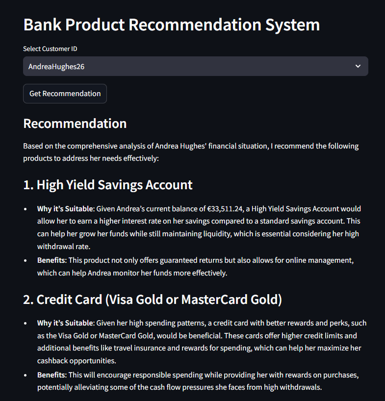
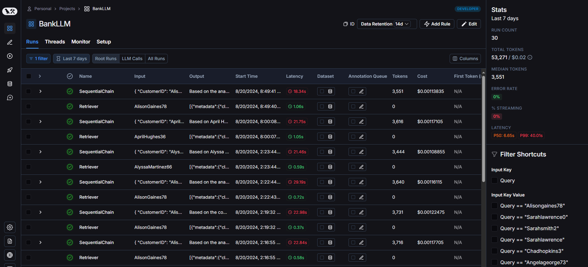

# BankLLM

BankLLM is an AI-driven recommendation engine designed for banking applications. The project analyzes customer data from a mobile banking application to generate personalized product recommendations using OpenAI's advanced models. The system integrates various modern tools and practices to ensure a robust, scalable, and user-friendly experience, following an LLMOps approach to manage the lifecycle of large language models.



## Table of Contents
- [Project Overview](#project-overview)
- [System Architecture](#system-architecture)
- [Data Schema](#data-schema)
- [LangChain & LangServe Integration](#langchain--langserve-integration)
- [Vector Database Integration](#vector-database-integration)
- [Project Structure](#project-structure)
- [Installation](#installation)
- [Setup](#setup)
- [Usage](#usage)
- [API Documentation](#api-documentation)


## Project Overview

BankLLM leverages artificial intelligence to provide personalized banking product recommendations based on both customer financial data and available banking products stored in a MySQL database. The project uses OpenAI's models through LangChain and LangServe to create a sophisticated recommendation engine that analyzes customer data and suggests relevant banking products, enhancing the overall customer experience.

The system is built with FastAPI for the backend, Streamlit for the frontend, and integrates monitoring tools like LangSmith to track performance and optimize the recommendation process. This project follows an LLMOps methodology, which focuses on the operationalization and lifecycle management of large language models in production.


## System Architecture

The architecture of BankLLM is designed to be modular, scalable, and easy to manage. It consists of the following components:

1. **MySQL Database**:
   - Stores Customer & Product Data.

2. **Data Retrieval**:
   - Customer and product data are automatically fetched from MySQL when the app starts.

3. **FAISS Vector Store**:
   - Customer data is embedded and stored in FAISS for efficient retrieval.

4. **Backend API (FastAPI + LangServe)**:
   - Handles API requests and LangChain processing.

5. **Frontend Interface (Streamlit)**:
   - Provides an interface for customer selection and displaying recommendations.

6. **LangChain Sequential Chain**:
   - Processes the data through two chains: Data Analyst Chain and Recommendation Specialist Chain.

7. **Monitoring & Analytics (LangSmith)**:
   - Monitors system performance and optimizes the recommendation process.

### Visual Representation of Architecture
```bash
+--------------------------+             
|      MySQL Database       |  # Stores Customer & Product Data
|  (Customer & Product Data)|  
+--------------------------+
        |
        |
        v
+----------------------------+                 
|  Fetch Data from MySQL      |  # Automatically on App Start
|  (Customer & Product Data)  |
+----------------------------+
        |                               
        |                               
        v                               
+-----------------------+              
| Customer Data Embedding|              
| & Storage in FAISS     |              
| Vector DB              |              
+-----------------------+              
        |                               
        |                               
        v                               
+----------------------+                      
| Backend API (FastAPI) |  # API Interface for Client-Server Communication   
|   + LangServe         |  # Handles LangChain Processing
+----------------------+
        |                                       
        |                                       
        v                                       
+----------------------+                      
| GET Request:         |  # Retrieve Customer IDs for Selectbox   
| Retrieve Customer IDs|  (Streamlit) 
+----------------------+
        |                               
        |                               
        v                               
+-------------------------+                 
| Frontend Interface      |  # Streamlit Interface
| (Streamlit)             |  # Customer Selection and Recommendation Display
+-------------------------+  
        |                               
        |                               
        v                               
+-----------------------+                 
| POST Request:         |  # Generate Recommendation using LangChain Sequential Chain
| Generate Recommendation|  - Data Analyst Chain
+-----------------------+  - Recommendation Specialist Chain
        |                               
        |                               
        v                               
+------------------------+                 
| Display Final          |  # Display Final Recommendation in Streamlit
| Recommendation         |  
+------------------------+   
        |
        |
        v
+------------------------+                 
| Monitoring & Analytics |  # LangSmith Monitoring for Performance
| (LangSmith)            |  
+------------------------+

```
## Data Schema

The **BankLLM** project uses detailed customer and product data from a mobile banking application to generate recommendations. Below is the schema and description of each key field:

### Customer Data

- **CustomerID**: Unique identifier for each customer.
- **FirstName**: The customer's first name.
- **LastName**: The customer's last name.
- **Gender**: The customer's gender (Male/Female).
- **Email**: The customer's email address.
- **Phone**: The customer's phone number.
- **Age**: The customer's age.
- **City**: The city where the customer resides.
- **Country**: The country where the customer resides.
- **CurrentBalance**: The current balance in the customer's primary account.
- **Currency**: The currency of the account balance (e.g., USD, EUR).
- **TotalTransactions**: Total number of financial transactions performed by the customer.
- **TotalDeposits**: Total amount of money deposited by the customer.
- **TotalWithdrawals**: Total amount of money withdrawn by the customer.
- **AverageTransactionAmount**: Average amount per transaction.
- **TotalCashback**: Total cashback earned by the customer.
- **LastTransactionDate**: Date of the last transaction performed by the customer.
- **PreferredContactMethod**: The customer's preferred method of contact (Email, Phone, SMS).
- **AverageMonthlySpending**: Average monthly spending of the customer.
- **HighestTransactionAmount**: Highest amount spent in a single transaction.
- **LowestTransactionAmount**: Lowest amount spent in a single transaction.
- **TotalNumberOfAccounts**: Total number of financial accounts the customer holds.
- **AccountStatus**: Status of the customer's account (Active, Dormant).
- **RiskProfile**: Financial risk profile of the customer (Low, Medium, High).
- **DepositStatus**: Whether the customer has an active deposit (Yes, No).
- **LoanStatus**: Whether the customer has an active loan (Yes, No).
- **InternationalTransactionIndicator**: Number of international transactions performed by the customer.
- **VATUserStatus**: Indicates whether the customer is a VAT user (Yes, No).
- **TotalVATRefundAmount**: Total amount of VAT refund claimed by the customer.
- **DeviceModel**: Model of the device used for banking transactions.
- **AppVersion**: Version of the banking app used by the customer.
- **RecentActivityFlag**: Indicates if the customer has had recent financial activity (Yes, No).
- **PreferredLanguage**: The customer's preferred language for communication.
- **Delivery**: Total amount spent on delivery services.
- **PlasticCard**: Type of plastic card the customer holds (e.g., Visa Classic, MasterCard Gold).

### Product Data

- **product_id**: Unique identifier for each product.
- **name**: Name of the banking product.
- **description**: A brief description of the product.
- **features**: Key features and benefits of the product.
- **category**: The category of the banking product (e.g., Plastic Card, Deposit, Loan).

### Example MySQL Database Structure
- **Customer Profile Table**:

  

- **Products Table**:

  

## LangChain & LangServe Integration



**BankLLM** utilizes LangChain and LangServe to power its recommendation engine. The recommendation process is managed through two primary chains:

1. **Data Analyst Chain**: This chain is responsible for analyzing the customer’s financial data, identifying key metrics, patterns, and potential needs based on the customer’s transaction history and financial profile.

2. **Recommendation Specialist Chain**: Based on the analysis provided by the Data Analyst Chain, this chain generates specific product recommendations that align with the customer’s financial needs and goals.

The models used by these chains are deployed and served using **LangServe**, ensuring efficient and scalable model serving.

### LangSmith Monitoring


## Vector Database Integration

The project integrates FAISS as a vector database to store and retrieve customer information efficiently. FAISS, paired with OpenAIEmbeddings, enables fast similarity searches within the customer data, ensuring that the most relevant customer information is retrieved and analyzed for product recommendations.

- **OpenAIEmbeddings**: The customer data is embedded using OpenAI's `text-embedding-ada-002` model, which transforms textual data into high-dimensional vectors.
- **FAISS**: These embeddings are stored in a FAISS vector store, allowing for rapid retrieval of similar customer profiles based on the current customer's data.

### How It Works
1. **Document Storage**: Each customer's data is stored as a document in FAISS after being converted into embeddings.
2. **Query and Retrieval**: When a recommendation is requested, the system retrieves the most relevant customer profile(s) from FAISS based on similarity to the query.
3. **SequentialChain Execution**: The retrieved customer data is then processed through the `SequentialChain` for analysis and recommendation generation.

## Project Structure

```bash
BankLLM/
│
├── src/                    
│   ├── app.py                   # FastAPI application file
│   ├── client.py                # Streamlit client interface
│   ├── config.py                # Configuration file for environment variables
│   ├── db_connect.py            # Script for database connections and data fetching
│   └── requirements.txt         # Python dependencies for the project
│
├── data/                    # Data Generation and SQL Scripts
│   ├── faker_data.py            # Script to generate synthetic customer data
│   ├── inserting_data.py        # Script to generate SQL INSERT statements for customer data
│   ├── customer_profile_insert_statements.sql   # SQL script for creating and inserting customer profile data
│   ├── products_insert.sql      # SQL script for creating and inserting product data
│   ├── customer_profile.json    # JSON file storing fetched customer profile data
│   ├── products.json            # JSON file storing fetched product data
│
├── docs/                    # Project documentation and visual demonstrations
│   ├── mysql.png               # Screenshot of MySQL customer profile table
│   ├── mysql_products.png      # Screenshot of MySQL products table
│   ├── langsmith.png           # Screenshot of LangSmith trace monitoring
│   ├── langsmith_monitor.png   # Screenshot of LangSmith monitoring
│   ├── api.png                 # API Documentation screenshot
│   ├── client_streamlit.png    # Streamlit client recommendation example
│
├── README.md                # Project README

```


## Installation

1. **Clone the repository**:

```bash
git clone https://github.com/Omar-Karimov/BankLLM.git
cd BankLLM
```

2. **Create and activate a virtual environment**:

```bash
conda create -n bankllm python=3.10 -y
conda activate bankllm
```

3. **Install the required Python dependencies**:

```bash
pip install -r requirements.txt
```

4. **Set up the MySQL database**:

- Use the provided SQL scripts (customer_profile_insert_statements.sql, products_insert.sql) in the data/ directory to populate the customerprofile and products tables in your MySQL database.


## Setup

1. **Create a .env file**:
   - Before running the application, users need to create a `.env` file in the `src/` directory to store their API keys and configuration details. This file should include the necessary environment variables such as API keys, database credentials, and any other configurations required for the project.

2. **LangSmith Account**:
   - Users should have a LangSmith account to enable monitoring and analytics features. The LangSmith API key should be added to the `.env` file along with other environment variables.


## Usage

1. **Start the FastAPI server**:

```bash
uvicorn app:app --reload
```

2. **Run the Streamlit client application**:

```bash
streamlit run client.py
```

3. **Access the application in your web browser at `http://localhost:8501`**


##  API Documentation


**You can access the API documentation at**:

```bash
http://127.0.0.1:8000/docs
```

**This includes the following endpoints**:

- `GET /customers` - Retrieves a list of all customer IDs. This endpoint is typically used to populate the customer selection dropdown in the Streamlit interface.

- `POST /recommendation` - Generates a bank product recommendation for a specified customer ID. This endpoint triggers the LangChain process, which analyzes customer data and provides tailored product suggestions.